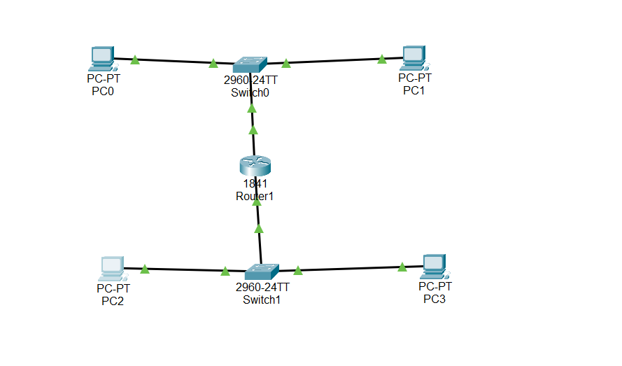
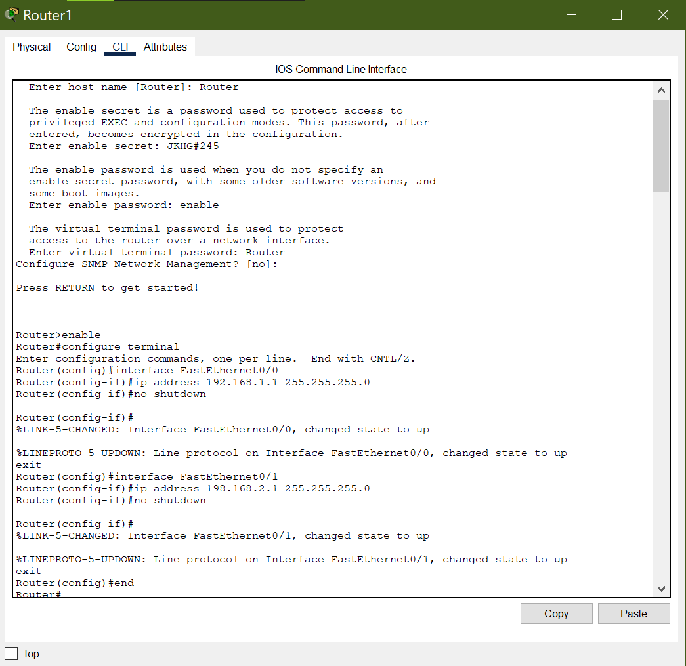
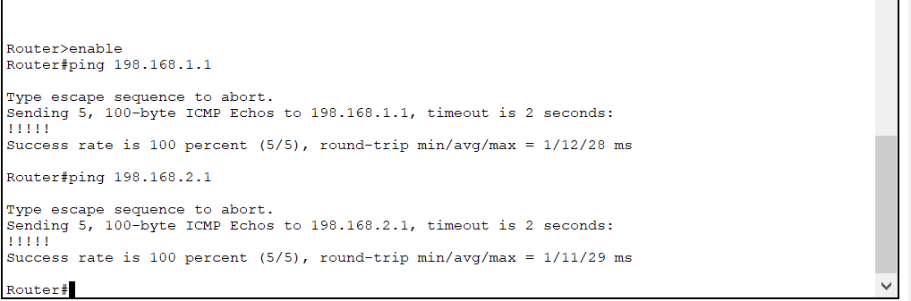
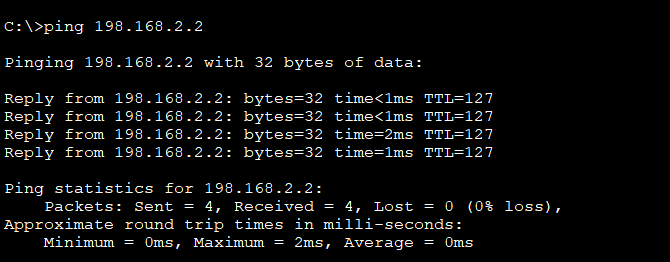
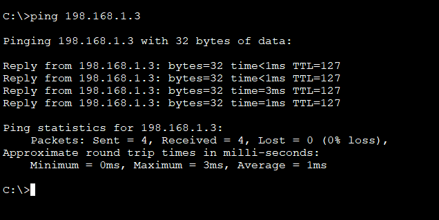

# Hands-On Report

## Objective
- To identify and configure IP addresses, subnet masks, and gateways on Windows systems.
- To create and connect two separate networks using Packet Tracer and test inter-network communication.

---

## Part 1: IP Configuration on Windows

### Tools Used
- Windows 10 PC
- Command Prompt (`cmd`)

### Procedure
1. Open **Command Prompt**.  
2. Run the command:
   ```cmd
   ipconfig
3. Record the following details:
- IP Address
- Subnet Mask
- Default Gateway  

### Conclusion
- IP, subnet mask, and gateway were correctly configured.  

---

## Part 2: Packet Tracer – Connecting Two Networks

### Objective
To connect two separate networks via a router and test communication across subnets.

### Topology



### Procedure

1. Create two separate LANs with PCs and switches.
2. Connect both LANs to a router.
3. Assign IP addresses:
    - LAN1: 198.168.1.0/24
    - Router Fa0/0: 198.168.1.1
    - LAN2: 198.168.2.0/24
    - Router Fa0/1: 198.168.2.1
4. Enable router interfaces:
    ```
    Router> enable
    Router# configure terminal
    Router(config)# interface FastEthernet0/0
    Router(config-if)# ip address 192.168.1.1 255.255.255.0
    Router(config-if)# no shutdown
    Router(config-if)# exit
    Router(config)# interface FastEthernet0/1
    Router(config-if)# ip address 192.168.2.1 255.255.255.0
    Router(config-if)# no shutdown
    Router(config-if)# exit
    ```


Shows ping results from router interfaces:
  

5. Test connectivity by pinging across subnets:
    ```
    PC0> ping 192.168.2.2
    PC3> ping 192.168.1.3
    ```
### Ping Test from PCs
Shows ping results from PC0 → PC2 and PC3 → PC1, verifying inter-subnet connectivity.
 
 

### Observations

| Source | Destination | Result     |
|--------|-------------|------------|
| PC0    | PC2         | Successful |
| PC3    | PC1         | Successful |

### Conclusion
- The router successfully connects the two networks.  
- PCs in separate subnets can communicate through the router.  
- IP configuration, subnetting, and routing were correctly implemented.
